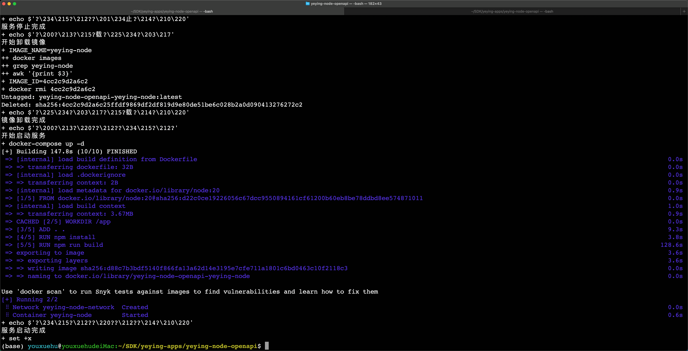
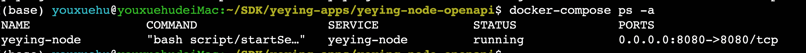

# yeying-node-openapi

# 本地部署

    bash script/runner.sh -e dev

# 访问 api-docs

    http://localhost:9101/api-docs/


# 测试环境部署： 走 docker-compose 部署
    ``` shell
    # 直接执行如下命令
    cp .env.template .env
    bash deploy.sh
    ```

# 如果遇到 data 目录无法访问

    ```shell
    sudo chown -R 1001:1001 ./data
    ```

# 生产环境部署： 走 docker-compose 部署

## 注册身份

    注册身份文件 node.id, 替换 mount/node.id

## 修改启动参数

    cp .env.template .env
    修改 .env 文件， 一般修改如下2个参数
    APP_ENV 表示部署的环境，生产的改成 prod
    PASSWORD 表示 node.id 的密码
    

## 执行启动命令

    bash deploy.sh






